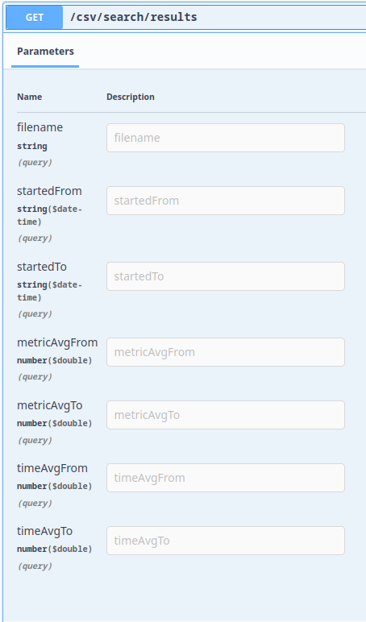
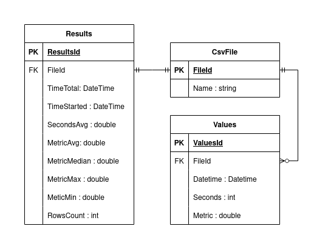

# Тестовое задание 

## Описание задания
[task.pdf](Docs/Task/task.pdf)

## Описание решения

### API

### Схема БД:

### Ручное тестирование
[Скрипт для генерации](./Docs/CsvExamples/csv_generator.py)

[Тестовые файлы](./Docs/CsvExamples)

> Команда для генерации `file1.csv`

    python3 ./csv_generator.py --metric-min 1000 --metric-max 2000 --shift 5 --count-rows 1000 > ./file1.csv

> Команда для генерации `file2.csv`

    python3 ./csv_generator.py --metric-min 100 --metric-max 200 --shift 1 --count-rows 1000 > ./file2.csv

### Модульное тестирование
[UnitTests.cs](../Tests/UnitTests.cs)
